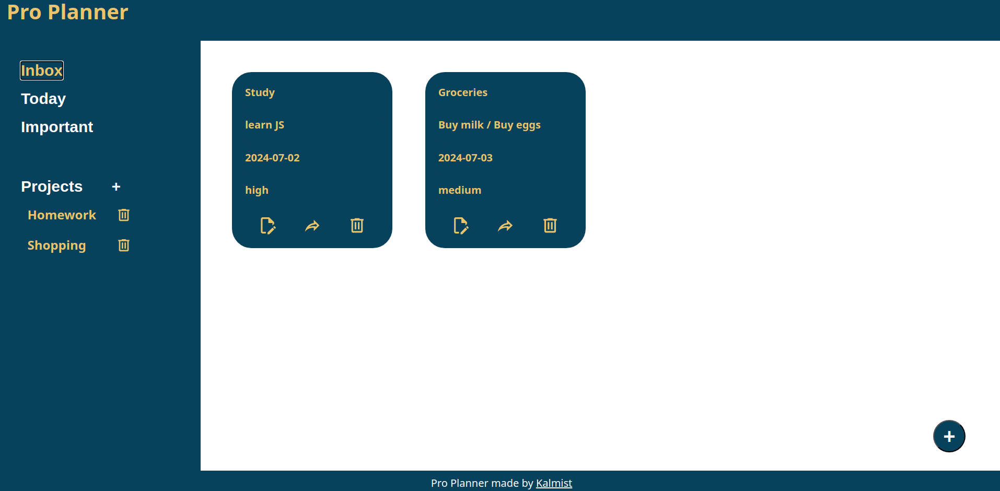

# Pro Planner
Pro Planner is an intuitive to-do list application designed to help you manage your tasks and projects efficiently. With Pro Planner, you can create tasks, organize them into projects, and easily keep track of your priorities and deadlines.

## Features

- **Task Creation:** Easily create new tasks using the bottom right "+" button.
- **Project Management:** Organize your tasks into different projects by creating new projects with the "+" button in the sidebar.
- **Task Organization:** Move tasks from the inbox to any project to keep your tasks organized.
- **Task Editing:** Edit your tasks to update details as needed.
- **Filters:** View your tasks filtered by today's tasks and high priority tasks for better focus.
- **Local Storage:** Accidentally closed or left the page? No worries! Your data is saved locally on your device, so you'll never lose your tasks and projects.

## Sample Screenshot

## Demo

https://belhassenb.github.io/todo-list/